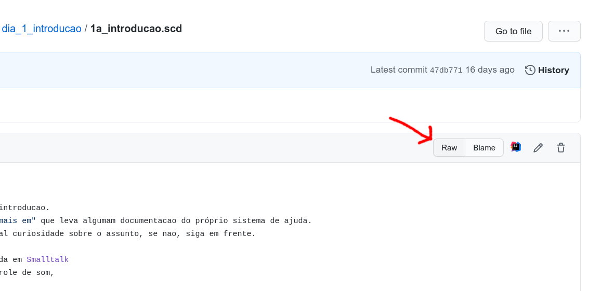
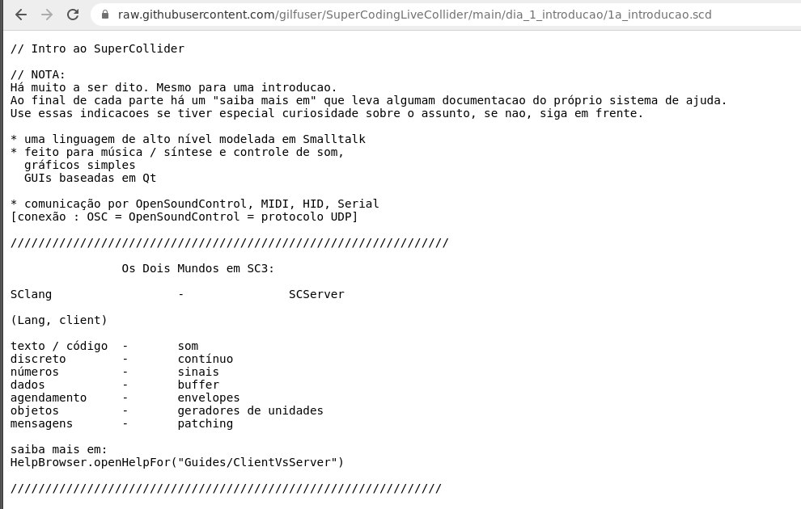
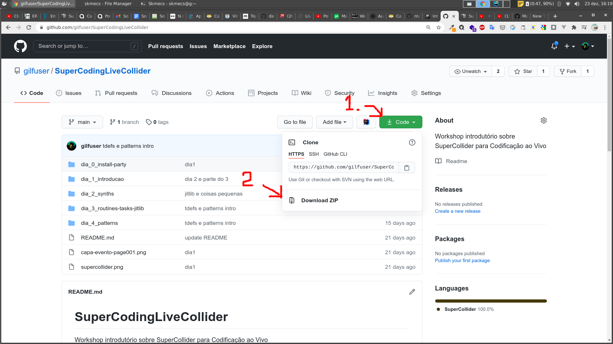

# SuperCodingLiveCollider
Workshop introdutório sobre [SuperCollider](https://supercollider.github.io) com um olho na Codificação ao Vivo

Se você ainda nao instalou o SuperCollider veja como em [dia 0](./dia_0_install-party). Se tiver qualquer problema, por favor, relate-o na sessao [Discussions](https://github.com/gilfuser/SuperCodingLiveCollider/discussions) desse repositório. Aliás, relate ali qualquer dúvida sobre qualquer assunto tratado aqui.

## Sobre esse repositório

Aqui está documentado, organizado e revisado o conteúdo dado no workshop/oficina em dezembro de 2020.

O conteúdo está divido pelos dias em que os seus tópicos foram abordados. Em cada pasta nomeada conforme dia e assunto encontram-se as explicações, referências, dicas e conceitos sobre o assunto ali tratado e um ou mais arquivos `.scd` para serem abertos no próprio SuperCollider para experimentação e testes.

Há duas maneiras de usar esses arquivos `.scd` e esse repositório como um todo: online e offline.
* **online**:
    * clique no link para o arquivo e em `raw`

    * a página aparecerá algo como essa
    
    * Clique na página, selecione tudo (Ctrl + a), copie (Ctrl + c)
    * No SuperCollider IDE crie um novo arquivo (Ctrl + n) e cole o que copiou (Ctrl + v)

* **offline**
  * o modo simples é baixar o repositório todo.
    
    a desvantagem desse modo é que se perde a formatação dos arquivos `.md` que estão na raiz das pastas assim como desse arquivo que estás a ler.  
    
  * se tem familiaridade com o git e GitHub, a forma recomendada é clonar o repositório na sua máquina. Assim pode-se atualiza-lo sempre que houver alguma atualização do repositório.

### Referências, dicas e fontes de informação sobre SuperCollider

* [Uma Gentil Introdução ao SuperCollider](http://docplayer.com.br/33316414-Uma-gentil-introducao-ao-supercollider.html)
* [versão em inglês(original)](https://ccrma.stanford.edu/~ruviaro/texts/A_Gentle_Introduction_To_SuperCollider.pdf)
* [inscreva-se na lista de discussão sobre SC. Perguntas de iniciantes sao bem-vindas!](http://www.birmingham.ac.uk/facilities/ea-studios/research/supercollider/mailinglist.aspx)
  [inscreva-se também no SCSynth, um fórum mais moderno sobre SC](http://scsynth.org/)
* [A Practical Guide To Patterns - nao tão gentil quanto o texto de B. Ruviaro, e com algumas sintaxes "depreciadas", mas ainda assim muito bom](http://distractionandnonsense.com/sc/A_Practical_Guide_to_Patterns.pdf)
* [O Sistema de Ajuda do SC, online](https://doc.sccode.org/)
* [Muitos exemplos. Alguns funcionam, outros nao](https://sccode.org/)
* [a série clássica de videoaulas de Eli Fieldsteel](https://www.youtube.com/playlist?list=PLPYzvS8A_rTaNDweXe6PX4CXSGq4iEWYC)
* [a "nova temporada"](https://www.youtube.com/playlist?list=PLPYzvS8A_rTZmJZjUtMG6GJ2QkLUEaY4Q)
* [o canal da S4NTP no YouTube](https://www.youtube.com/channel/UCFRw4fgQb7dqRXuZ5lxwi3g)

### Agradecimentos

Agradeço aos mestres `["Alberto de Campo", "Fredrik Orlofson", "Hannes Hoelzl"].scramble` e a S4NTP toda.
Muito do material que está aqui é compilado adaptado ou inspirado em oficinas e aulas dessas pessoas. Há também material vindo das video-aulas de Eli Fiedsteel e no excelente texto **Uma Gentil Introdução ao SuperCollider** de Bruno Ruviaro.
Agradeco em geral à toda comunidade do *mailing-list* sc-users. Nenhuma outra comunidade em torno de linguagem ou ‘software’ me foi tão paciente, simpática, porém séria, acolhedora e prestativa quanto essa.

