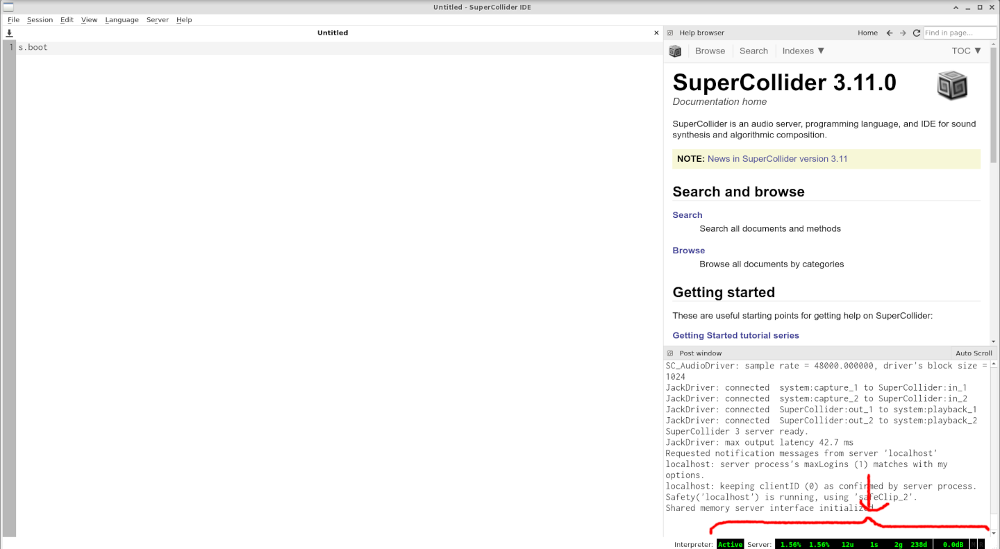

# Instalação do SuperCollider

#### O SC funciona em macOS, Linux e Windows, incluindo em computadores de placa única como Raspberry Pi e BeagleBone Black

Baixe aqui: [https://supercollider.github.io/download](https://supercollider.github.io/download)

Felizes utilizadoras de Mac e Windows podem simplesmente usar as versões já compiladas encontradas no *link* acima. Já utilizadoras de Linux terão que compilar por si mesmas.

Sempre há a opção de fazer o *build* direto do repositório aqui: [https://github.com/supercollider/supercollider](https://github.com/supercollider/supercollider)

As questões específicas dos OSs citados acima sao tratadas nos *links* a seguir. <br/>
**Leia, por favor, a página referente ao seu sistema operacional:**
* [Linux](https://github.com/supercollider/supercollider/blob/develop/README_LINUX.md)
* [macOS](https://github.com/supercollider/supercollider/blob/develop/README_MACOS.md)
* [Windows](https://github.com/supercollider/supercollider/blob/develop/README_WINDOWS.md)

## Teste a instalação

Após instalar e abrir o SCIDE estará a encarar o paradigma da página em branco, ou seja, de (quase) infinitas possibilidades. A primeira coisa a fazer é se certificar de que o servidor de som funciona.

Inicie o servidor: <br/>
execute `s.boot` ou pressione Cmd + B

se deu certo verá que o que era branco assim: <br/>


ficou verde assim: <br/>


Aí é só executar essa linha: <br/>
`().play`

e ouvirá o dó central do piano.

Se isso não acontecer, [conte aqui](https://github.com/gilfuser/SuperCodingLiveCollider/discussions) e tentaremos descobrir o porquê.

## Quarks

Do sistema de Ajuda:
> Quarks são pacotes de código SuperCollider contendo classes, métodos de extensão, documentação e plug-ins UGen de servidor. A classe Quarks gerencia o download desses pacotes e a instalação ou desinstalação.
 
Em termos simples, **Quarks** são partes extra que expandem as capacidades do SC. Há também plugins, os SC3-Plugins, mas isso nao vem ao caso agora.

Instalemos os **Quarks** qde que vamos precisar mais adiante.

Pode-se ver todos os Quarks existentes ao executar `Quarks.gui`, baixar e instalar a partir da janela então aberta, ou instalar diretamente ao executar as seguintes linhas:

```supercollider
Quarks.install("adclib");
Quarks.install("Bjorklund");
Quarks.install("JITLibExtensions");
Quarks.install("HyperDisCo");
Quarks.install("Influx");
Quarks.install("KtlLoop");
Quarks.install("Modality-toolkit");
Quarks.install("StartupFile");
```

Em seguida tem-se que recompilar a biblioteca de classes. Vá em **Language > Recompile Class Library**
